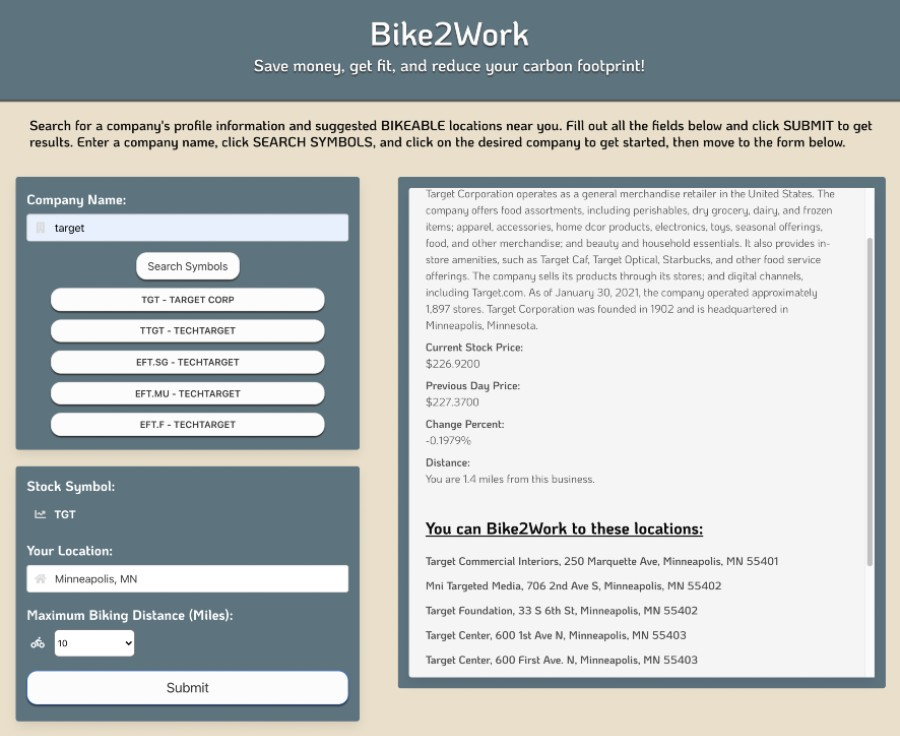

# Bike2Work

## Description
For this group project, we built a webpage that allow user to find a workplace near their home that they can bike to and also give the user a brief information about the company 

Deployed link: https://hope1407.github.io/Bike2Work/

## Final product overview
web page

## User story
- As a User
 I WANT to get information about the company that I want to work there
 I WANT to know if there are locations within a reasonable distance
 SO THAT I can plan on bike to work

## Acceptance criteria
GIVEN a Bike2Work webpage
WHEN I search a stock symbol by company's name THEN I see a list of stock symbol
When I click on a stock symbol Then I am presented with company's overview infomation and distance to headquater 
When I select maximum biking distance THEN I presented with locations that is bikeable
When I refresh the page THEN I am shown the last location I searched

## Credits
Bike2Work is created and maintained by Brian Palay, John Hope, Jorge B and Tuyet Nguyen

## Thanks to
Thanks to our Instructor Charlie Werness, our TAs Daniel Vitelli, Mai Hashad and Vito

## License
MIT License

Copyright (c) 2021  Brian Palay, John Hope, Jorge B and Tuyet Nguyen

Permission is hereby granted, free of charge, to any person obtaining a copy of this software and associated documentation files (the "Software"), to deal in the Software without restriction, including without limitation the rights to use, copy, modify, merge, publish, distribute, sublicense, and/or sell copies of the Software, and to permit persons to whom the Software is furnished to do so, subject to the following conditions:

The above copyright notice and this permission notice shall be included in all copies or substantial portions of the Software.

THE SOFTWARE IS PROVIDED "AS IS", WITHOUT WARRANTY OF ANY KIND, EXPRESS OR IMPLIED, INCLUDING BUT NOT LIMITED TO THE WARRANTIES OF MERCHANTABILITY, FITNESS FOR A PARTICULAR PURPOSE AND NONINFRINGEMENT. IN NO EVENT SHALL THE AUTHORS OR COPYRIGHT HOLDERS BE LIABLE FOR ANY CLAIM, DAMAGES OR OTHER LIABILITY, WHETHER IN AN ACTION OF CONTRACT, TORT OR OTHERWISE, ARISING FROM, OUT OF OR IN CONNECTION WITH THE SOFTWARE OR THE USE OR OTHER DEALINGS IN THE SOFTWARE.